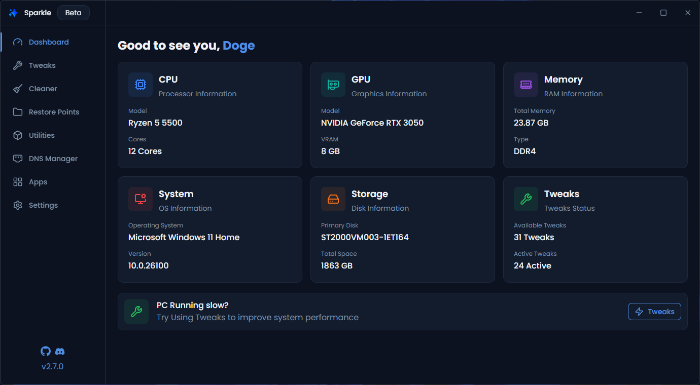

# Pecinhas

<div align="center">
  
  
  <h3>Pecinhas</h3>
  <p>Um aplicativo Windows para otimizar e debloat seu PC</p>

  <p>
    
    
    
    
  </p>

Instalar com PowerShell:

```powershell
irm https://pecinhas.net/get | iex
```

<a href="https://github.com/PecinhasFPS/Pecinhas-V2/releases/latest">Download Installer/Portable</a>

  <br/>
  <br/>

  

</div>
  
  > [!WARNING]
  > Pecinhas está atualmente em desenvolvimento. Embora tenha sido testado extensivamente, você pode encontrar alguns bugs. Faça backup do seu sistema antes de aplicar tweaks e relate quaisquer problemas que encontrar.

<div align="center">
  <h3>🚀 Funcionalidades</h3>

  <ul align="left">
    <li>📈 Aplicar Tweaks para Otimizar seu sistema</li>
    <li>🗑️ Gerenciar todos os arquivos temporários em um só lugar</li>
    <li>🎛️ Instalar aplicativos com a integração Winget integrada</li>
    <li>📁 Backup e Reverter alterações</li>
    <li>⚙️ Ver informações básicas do sistema</li>
  </ul>
</div>

<div>
  <h2>📃 Documentação</h2>
  <p>Você pode encontrar a documentação <a href="https://pecinhas.net">aqui</a></p>
  A documentação cobre todos os tweaks, como funcionam, o que fazem e todas as páginas do Pecinhas
</div>

<div>
  <h3>💖 Créditos</h3>
  <ul>
    <li>
      <a href="https://github.com/ChrisTitusTech/winutil">CTT's WinUtil (Alguns dos tweaks & parte da inspiração para fazer esta versão do projeto)</a>
    </li>
    <li>
      <a href="https://github.com/Raphire/Win11Debloat">Win11Debloat (Script principal de debloat do Windows)</a>
    </li>
    <li>
      <a href="https://github.com/Parcoil/Sparkle">Sparkle (Projeto original que serviu de base)</a>
    </li>
  </ul>

  <h3>👥 Contribuindo</h3>

  <h4>Adicionando Novos Tweaks</h4>
  <ul>
    <li>Tweaks estão localizados em <code>resources/tweaks/</code></li>
    <li>Mais informações em <code>resources/tweaks/readme.md</code></li>
  </ul>

Consulte a <a href="https://pecinhas.net">documentação</a> para mais informações sobre como adicionar novos tweaks

  <h4>Outras Formas de Contribuir</h4>
  <ul>
    <li>🐛 Relatar bugs e problemas</li>
    <li>💡 Sugerir novos recursos ou melhorias</li>
    <li>📝 Melhorar a documentação</li>
    <li>🎨 Aprimorar a UI/UX</li>
    <li>🧪 Melhorar a qualidade do código</li>
  </ul>

<h4>🛠️ Compilando o Pecinhas</h4>

<p>Para compilar o Pecinhas você precisará do seguinte</p>
<ul>
  <li><b>Node.js</b> v22 ou superior</li>
  <li><b>PNPM</b></li>
  <li><b>Windows 10/11</b></li>
</ul>

</div>

> [!IMPORTANT]
> A versão do Pecinhas no repositório provavelmente é mais recente que o último release. Espere bugs e recursos não lançados

<ol>
  <li>
    <b>Clone o repositório:</b>
    <pre><code>git clone https://github.com/PecinhasFPS/Pecinhas-V2
cd Pecinhas-V2</code></pre>
  </li>
  <li>
    <b>Instale as dependências:</b>
    <pre><code>pnpm install</code></pre>
  </li>
  <li>
    <b>Inicie o app em modo de desenvolvimento:</b>
    <pre><code>pnpm dev</code></pre>
    <i>Isso vai lançar o Pecinhas com hot reload para ambos os processos main e renderer do Electron.</i>
  </li>
  <br/>
  <li>
    <b>Compile para produção:</b>
    <pre><code>pnpm build</code></pre>
    <i>Isso vai gerar builds otimizados de produção.</i>
  </li>
</ol>
 <br/>
  <p align="center">Feito com ❤️ por PecinhasFPS</p>

## Histórico de Estrelas

<a href="https://www.star-history.com/#PecinhasFPS/Pecinhas-V2&Date">
 <picture>
   <source media="(prefers-color-scheme: dark)" srcset="https://api.star-history.com/svg?repos=PecinhasFPS/Pecinhas-V2&type=Date&theme=dark" />
   <source media="(prefers-color-scheme: light)" srcset="https://api.star-history.com/svg?repos=PecinhasFPS/Pecinhas-V2&type=Date" />
   
 </picture>
</a>